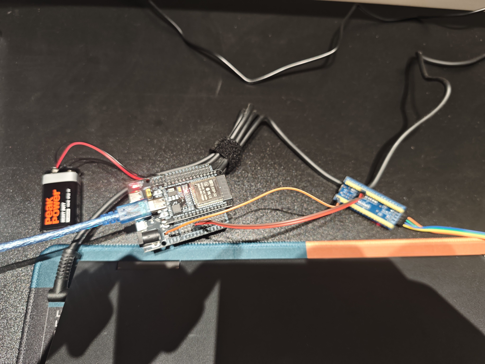

# 🚀 树莓派 5 + ESP32 + STM32 物联网设备控制平台

> **ESP32 无线网关**：连上 WiFi 后订阅树莓派（MQTT Broker）下发的指令，通过 UART 转发给 STM32；再把 STM32 回传的状态发布回 MQTT，实现「云 — 边 — 端」三级无线控制。

[](https://www.espressif.com/)
[](https://www.arduino.cc/en/software)
[](https://github.com/knolleary/pubsubclient)
[](https://mqtt.org/)
[](LICENSE)

---

## 📖 这是什么

本仓库是三级物联网控制链路中的**中间层（网关层）**固件：

- **边缘层（树莓派 5）**：MQTT Broker + 上位机，跑 Python 脚本或 Node-RED，负责界面、逻辑与数据记录。
- **网关层（ESP32）**：本仓库。连 WiFi → 订阅 MQTT 主题 → 把收到的 JSON / 字符串指令经 **UART** 转给 STM32；同时把 STM32 的回传数据转发回 MQTT。
- **终端层（STM32F103C8T6）**：硬实时执行器，直接控制 GPIO、TB6612 电机驱动、舵机等外设，并回传状态。

配套仓库：

| 仓库 | 角色 |
| --- | --- |
| [raspberrypi-5](https://github.com/Arduino-STM32-Dev/raspberrypi-5) | 树莓派 5 上位机 / MQTT Broker 环境搭建 |
| **esp32**（本仓库） | ESP32 无线网关：MQTT ↔ UART 双向转发 |
| [STM32](https://github.com/Arduino-STM32-Dev/STM32) | STM32F103 执行终端与入门教程 |

---

## 🎬 先看效果



---

## 🏗️ 系统架构

```text
[树莓派 5 (上位机 / MQTT Broker)]  mosquitto: 0.0.0.0:1883
        ⬆ (WiFi / MQTT)  订阅 pi/to/esp32  发布 esp32/status
[ESP32 (无线网关)]
        ⬇ (UART 115200, 8N1)
[STM32F103C8T6 (执行终端)]  PC13 LED / TB6612 / 舵机 …
```

**数据流：** `树莓派 → MQTT(pi/to/esp32) → ESP32 → Serial2 → STM32 → 执行动作 → Serial1 回传 → ESP32 → MQTT(esp32/status) → 树莓派`

---

## 🛠️ 硬件清单

| 硬件名称 | 数量 | 说明 |
| --- | :---: | --- |
| 树莓派 5 (8GB) | 1 | 上位机 + MQTT Broker |
| ESP32 开发板 | 1 | 无线网关（本仓库固件） |
| STM32F103C8T6 (BluePill) | 1 | 执行终端 |
| ST-Link V2 | 1 | STM32 烧录（SWD） |
| USB 转 TTL 模块 | 1 | 调试用 |
| 独立电源（电池盒 / 充电宝） | 2 | ⚠️ ESP32 与 STM32 **各自独立供电** |
| 杜邦线（母对母） | 若干 | 只需 TX / RX / GND 三根 |

> ✅ 实测：ESP32 用**电池 + 外接板**可长期独立运行，固件烧录后无需电脑介入。

---

## 🔌 引脚接线说明

| 设备 A | 设备 B | 说明 |
| --- | --- | --- |
| ESP32 `D17` (TX2) | STM32 `PA10` (RX) | 串口发送：指令下发 |
| ESP32 `D16` (RX2) | STM32 `PA9` (TX) | 串口接收：状态回传 |
| ESP32 `GND` | STM32 `GND` | **共地（必须连接）** |

> ⚠️ **TX 接 RX、RX 接 TX**（交叉接线），且 **ESP32 与 STM32 独立供电，请勿把 VCC 直接互连**。

固件中对应的引脚定义（[`firmware/esp32_test/esp32_test.ino`](firmware/esp32_test/esp32_test.ino#L11-L12)）：

```cpp
#define RXD2 16   // ESP32 RX2  ← STM32 PA9  (TX)
#define TXD2 17   // ESP32 TX2  → STM32 PA10 (RX)
```

---

## 💻 软件依赖

### 1. 树莓派端（MQTT 服务器）

```bash
sudo apt update
sudo apt install mosquitto mosquitto-clients
# 编辑 /etc/mosquitto/mosquitto.conf，允许外部设备连接：
#   listener 1883 0.0.0.0
#   allow_anonymous true
sudo systemctl restart mosquitto
```

### 2. ESP32 端（Arduino IDE）

| 项目 | 取值 |
| --- | --- |
| 开发板 | `ESP32 Dev Module` |
| 库 | **PubSubClient**（库管理器搜索安装） |
| 订阅主题 | `pi/to/esp32` |
| 发布主题 | `esp32/status` |
| 串口 | `Serial` 115200（调试）、`Serial2` 115200（对 STM32） |

上传前先把 `esp32_test.ino` 顶部的三个参数改成你自己的（出于安全考虑，仓库中留空）：

```cpp
const char* ssid        = "";   // 你的 WiFi 名称
const char* password    = "";   // 你的 WiFi 密码
const char* mqtt_server = "";   // 树莓派的 IP 地址
```

### 3. STM32 端（Arduino IDE）

| 项目 | 取值 |
| --- | --- |
| 开发板 | `Generic STM32F1 series` → `BluePill F103C8` |
| 上传方式 | `STM32CubeProgrammer (SWD)` / STLink |
| 固件 | [`STM32/firmware/raspberry-control-stm32`](https://github.com/Arduino-STM32-Dev/STM32) |
| 核心功能 | `Serial1` 接收指令、`PC13` 板载 LED 控制、状态回传 |

---

## 🚦 快速开始（测试指令）

在树莓派终端执行：

```bash
# 打开 STM32 板载 LED (PC13)
mosquitto_pub -h localhost -t "pi/to/esp32" -m "LED_ON"

# 关闭 STM32 板载 LED (PC13)
mosquitto_pub -h localhost -t "pi/to/esp32" -m "LED_OFF"

# 订阅 ESP32 回传的状态
mosquitto_sub -h localhost -t "esp32/status" -v
```

预期输出：

```text
收到树莓派指令 [pi/to/esp32]: LED_ON     ← ESP32 调试串口
收到 STM32 回传: LED 已打开              ← ESP32 调试串口
esp32/status LED 已打开                  ← 树莓派 mosquitto_sub
```

---

## 📂 仓库目录结构

```text
esp32/
├── README.md                       ← 你正在读的这份文档
├── LICENSE                         ← MIT 许可证
├── .gitignore / .gitattributes
├── firmware/
│   └── esp32_test/                 ← ESP32 网关固件（MQTT ↔ UART 双向转发）
│       └── esp32_test.ino
└── image-and-video/
    └── esp32-stm32-connect.jpg     ← ESP32 / STM32 接线实拍
```

---

## 🔍 核心实现要点

| 要点 | 说明 |
| --- | --- |
| WiFi 接入 | `setup_wifi()` 阻塞等待 `WL_CONNECTED`，连上后打印 ESP32 的 IP |
| MQTT 连接 | `PubSubClient` + 随机 `clientId`，连接成功后订阅 `pi/to/esp32` |
| 断线重连 | `loop()` 里检测 `client.connected()`，掉线自动重连（状态码 `rc` 用于排错） |
| 指令下发 | `callback()` 把 payload 拼成 `String`，用 `Serial2.println()` 发出 |
| 状态回传 | `Serial2.readStringUntil('\n')` 读 STM32 应答，`trim()` 后发布到 `esp32/status` |
| 心跳 | 每 5 秒向 STM32 发一次 `Hello STM32`，并向树莓派发布 `ESP32 在线` |

> ⚠️ **换行符约定**：ESP32 用 `println()` 发送、STM32 用 `readStringUntil('\n')` 解析；STM32 回传同理。**两端必须成对使用 `println` / `readStringUntil('\n')`**，否则会读到空串或粘包。

---

## 🚧 常见报错速查

| 报错 / 现象 | 原因 | 解决 |
| --- | --- | --- |
| MQTT 连接失败 `rc=-2` | mosquitto 只监听 `127.0.0.1`，或禁止匿名连接 | 修改 `/etc/mosquitto/mosquitto.conf`：`listener 1883 0.0.0.0` + `allow_anonymous true`，然后 `sudo systemctl restart mosquitto` |
| `rc=-4` | 用户名 / 密码错误 | 确认 `allow_anonymous true`，或补上 MQTT 账号密码 |
| `rc=2` / 一直重连 | `mqtt_server` 填错或树莓派不在同一网段 | `ping` 树莓派 IP；确认 ESP32 与树莓派同一 WiFi |
| WiFi 一直打印 `.` | SSID / 密码填错，或 ESP32 不支持 5GHz | 使用 **2.4GHz** 热点；核对 `ssid` / `password` 大小写 |
| 串口收到乱码 | 两端波特率或数据位不一致 | 统一 **115200, 8N1** |
| STM32 收不到指令 | TX / RX 未交叉，或**没共地** | 按上表重新接线，**务必连接 GND** |
| STM32 收到空行 / 反复触发 | 只用了 `print()`，没有换行符 | 改用 `println()` |
| 上传后 ESP32 反复重启 | 目标板选错 / 供电不足 | 选 `ESP32 Dev Module`；用独立电源或稳定 USB 口 |
| 树莓派收不到 `esp32/status` | 订阅主题写错，或 TLS / 端口不符 | 主题全小写核对：`esp32/status`，端口 `1883` |

---

## 📈 后续计划

- [ ] 树莓派端开发 Python GUI 或 Web 界面（或 Node-RED 流程）
- [ ] STM32 接入 DHT11 温湿度传感器，通过 ESP32 回传数据
- [ ] 增加 ESP32 掉线自动重连机制（WiFi 断开重连，当前只在 MQTT 层重连）
- [ ] 控制直流电机或舵机，实现物理动作
- [ ] 指令改用 JSON 格式，支持「设备 + 动作 + 参数」结构化下发
- [ ] OTA 远程升级 ESP32 固件

---

## 🤝 贡献与致谢

- 欢迎提交 Issue 反馈问题，或 PR 补充你的踩坑经验。
- 本仓库的组织方式参考了 [STM32](https://github.com/Arduino-STM32-Dev/STM32) 与 [Arduino-Intro](https://github.com/Arduino-STM32-Dev/Arduino-Intro)。

## 📄 许可证

本项目采用 **MIT License**，详见 [LICENSE](LICENSE)。
